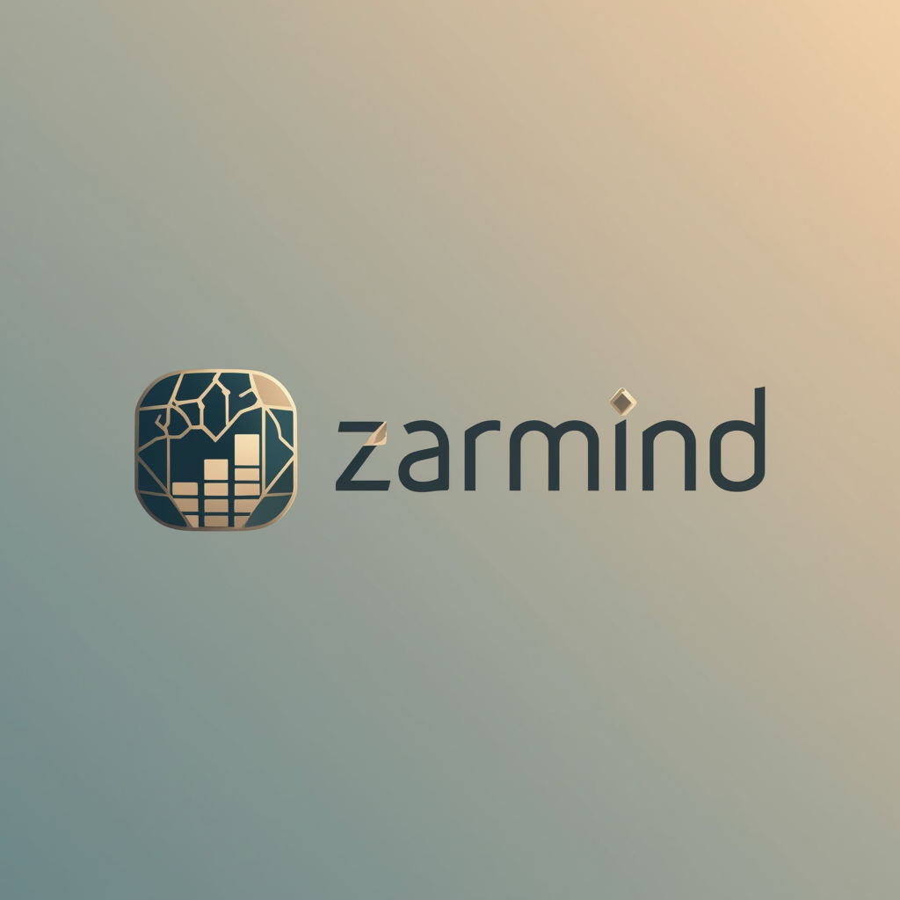

# 💎 Zarmind - سیستم حسابداری هوشمند طلافروشی

<div align="center">



**سیستم حسابداری هوشمند برای طلافروشی‌ها با قابلیت‌های هوش مصنوعی**

[](LICENSE)
[](https://www.typescriptlang.org/)
[](https://nodejs.org/)
[](https://www.postgresql.org/)

[فارسی](#-درباره-پروژه) | [English](#-about)

</div>

---

## 📋 فهرست مطالب

- [درباره پروژه](#-درباره-پروژه)
- [ویژگی‌های کلیدی](#-ویژگیهای-کلیدی)
- [تکنولوژی‌ها](#️-تکنولوژیها)
- [پیش‌نیازها](#-پیشنیازها)
- [نصب و راه‌اندازی](#-نصب-و-راهاندازی)
- [ساختار پروژه](#-ساختار-پروژه)
- [API Documentation](#-api-documentation)
- [استفاده](#-استفاده)
- [مشارکت](#-مشارکت)
- [لایسنس](#-لایسنس)

---

## 🌟 درباره پروژه

**زرمند** یک سیستم حسابداری جامع و هوشمند برای طلافروشی‌ها است که با استفاده از هوش مصنوعی، فرآیندهای روزمره را سریع‌تر و دقیق‌تر می‌کند.

### 🎯 مشکلات حل شده:
- ⚡ ثبت دستی وزن از روی ترازو (با عکس‌برداری خودکار)
- 📊 مدیریت موجودی پیچیده طلا و جواهرات
- 💰 محاسبات دقیق قیمت بر اساس عیار و وزن
- 📈 گزارش‌گیری سریع و دقیق
- 👥 مدیریت مشتریان و فروش

---

## ✨ ویژگی‌های کلیدی

### 🤖 قابلیت‌های هوش مصنوعی

#### 📸 خواندن خودکار ترازو
- عکس‌برداری از صفحه ترازو
- تشخیص خودکار اعداد با OCR
- درج خودکار وزن در سیستم
- دقت بالا با پردازش تصویر پیشرفته

#### 🔮 قابلیت‌های آینده
- پیش‌بینی قیمت طلا با ML
- تشخیص خودکار نوع محصول از تصویر
- توصیه‌های هوشمند موجودی

### 💼 مدیریت موجودی
- ✅ ثبت محصولات با جزئیات کامل (وزن، عیار، نوع)
- ✅ دسته‌بندی (النگو، گردنبند، انگشتر، سکه، شمش و...)
- ✅ ردیابی موجودی real-time
- ✅ هشدار موجودی کم
- ✅ تاریخچه کامل تغییرات

### 💵 مدیریت فروش
- ✅ ثبت سریع فروش
- ✅ محاسبه خودکار قیمت
- ✅ مدیریت پیش‌فاکتور و فاکتور
- ✅ پشتیبانی از فروش اقساطی
- ✅ گزارش فروش روزانه/ماهانه

### 👥 مدیریت مشتریان
- ✅ پروفایل کامل مشتریان
- ✅ تاریخچه خرید
- ✅ مدیریت بدهی/طلبکار
- ✅ یادآوری خودکار پیگیری

### 📊 گزارش‌گیری پیشرفته
- ✅ داشبورد تحلیلی
- ✅ نمودارهای تعاملی
- ✅ گزارش سود و زیان
- ✅ تحلیل روند فروش
- ✅ خروجی PDF/Excel

### 🔐 امنیت
- ✅ احراز هویت JWT
- ✅ رمزنگاری رمز عبور با bcrypt
- ✅ سطوح دسترسی کاربران
- ✅ Audit Log کامل

---

## 🛠️ تکنولوژی‌ها

### Frontend
- **HTML5/CSS3/JavaScript** - UI ساده و سریع
- **Vazir Font** - فونت فارسی زیبا
- **RTL Support** - پشتیبانی کامل از راست‌چین
- **Responsive Design** - سازگار با موبایل و تبلت
- **Chart.js** - نمودارهای تعاملی

### Backend
- **Node.js** (v18+) - Runtime
- **TypeScript** (v5+) - Type Safety
- **Express.js** - Web Framework
- **PostgreSQL** (v15+) - Database
- **JWT** - Authentication
- **Multer** - File Upload
- **Tesseract.js / Google Vision API** - OCR

### DevOps
- **Docker** - Containerization
- **Docker Compose** - Multi-container orchestration
- **Git** - Version Control

---

## 📦 پیش‌نیازها

قبل از نصب، مطمئن شوید این موارد نصب شده‌اند:

```bash
- Node.js >= 18.x
- npm >= 9.x or yarn >= 1.22
- PostgreSQL >= 15.x
- Docker & Docker Compose (optional)
- Git